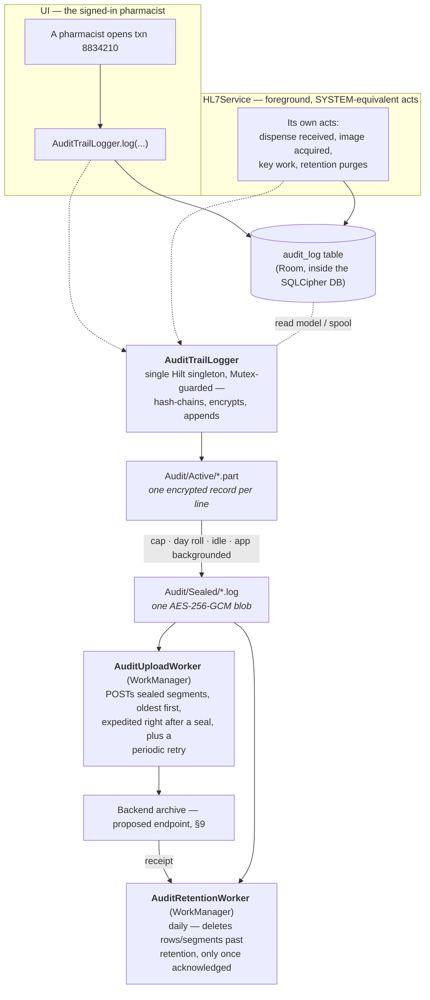
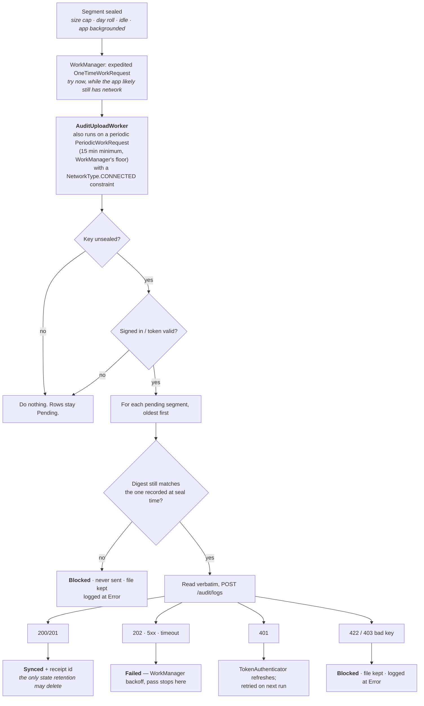

# HIPAA Audit Logging — Implementation Plan

**Pill Counter (Android) · single process, on-device, with archive upload**

Status: **proposed — not yet built.** The only thing in this codebase today called an audit
log is `core/security/SecurityAuditLogger`, and it is a different feature — see §0. Everything
in §3 onward is design to be implemented; file paths given are the paths it should land at, not
paths that exist yet, unless a section says otherwise.
Adapted from a design written for a different product (a Windows Service + Desktop pair) to fit
this app's actual architecture: one Kotlin/Hilt process, Room-over-SQLCipher, Retrofit/Moshi,
Android Keystore. Section numbering is kept close to the original so the two remain comparable
where the shape genuinely carries over, and diverges sharply where it doesn't (§9, §12).
Last verified against the codebase: 2026-08-31.

## Table of contents

0. [Don't confuse this with SecurityAuditLogger](#0-dont-confuse-this-with-securityauditlogger)
1. [What this satisfies](#1-what-this-satisfies)
2. [The shape of it](#2-the-shape-of-it)
3. [What is recorded](#3-what-is-recorded)
4. [What is never recorded](#4-what-is-never-recorded)
5. [Event schema](#5-event-schema)
6. [The hash chain](#6-the-hash-chain)
7. [On-disk layout](#7-on-disk-layout)
8. [Rotation](#8-rotation)
9. [Custody — the archive](#9-custody--the-archive)
10. [Retention](#10-retention)
11. [Settings](#11-settings)
12. [Trust boundaries — why this is simpler than a service/desktop split](#12-trust-boundaries--why-this-is-simpler-than-a-servicedesktop-split)
13. [Verifying a segment](#13-verifying-a-segment)
14. [Operations](#14-operations)
15. [Build sequencing](#15-build-sequencing)
16. [Known open items](#16-known-open-items)

## 0. Don't confuse this with `SecurityAuditLogger`

`app/src/main/java/com/rite/pillcounting/core/security/SecurityAuditLogger.kt` and
`AuditEvent.kt` already exist, are tested (`SecurityAuditLoggerTest.kt`, `AuditEventTest.kt`),
and are wired into `SecurityUtils.kt`'s device-integrity checks (root, debugger, emulator,
overlay, signature, install-source). It writes `PASS`/`FAIL` lines like
`1735000000000|SCREEN_OVERLAY|FAIL|` to a single Keystore-AES-GCM-encrypted file
(`security_audit.log` in `filesDir`, 512 KB rotation, no chaining) and never records who was
signed in or what patient data was touched.

That is a device-posture log. This document is about a **PHI access/activity log** —
§164.312(b) needs both, they answer different questions, and they must not become one class.
Two consequences for the build:

- **Naming collision.** A new `AuditEvent`/`AuditLog` in a different package (`core/audit`,
  proposed below) compiles fine, but a reviewer grepping the codebase for "audit" will find two
  unrelated things with overlapping names. Prefix the new one distinctly — this document uses
  `AuditTrailEvent` / `AuditTrailLogger` — or move the existing one to
  `DeviceIntegrityLogger`/`DeviceIntegrityEvent` while it's still small enough to rename safely.
  Pick one before writing any code; renaming after both exist orphans call sites twice.
- **They can share the Keystore pattern, not a key.** `SecurityAuditLogger` proves the pattern
  (Keystore-backed AES-256-GCM, IV prefixed to ciphertext) works fine on-device. The new trail
  should use its own key alias — see §7 — so a compromise or bug in one log's key handling
  cannot touch the other's.

## 1. What this satisfies

HIPAA's Security Rule imposes two requirements this subsystem exists for, both **required**
rather than addressable:

| Standard | Requirement | How it is met |
|---|---|---|
| §164.312(b) Audit Controls | Record and examine activity in systems containing ePHI | Every access, release and destruction of pill-count/dispense data is recorded, encrypted, and hash-chained so tampering is detectable |
| §164.312(a)(2)(i) Unique User Identification | Every action attributable to a specific person | Each event carries the operator's `userId`, a session id, the device id and the build. Acts with no signed-in operator are attributed to `SYSTEM` (the HL7 listener), never to whoever happens to be signed in |

## 2. The shape of it

The single biggest structural difference from the Windows design this was adapted from: **there
is one process.** No service/desktop split, no SYSTEM account, no credential that has to cross a
process boundary. The whole thing — recording, hash-chaining, encrypting, sealing, uploading,
retention — runs inside this app, gated by one in-process lock so two coroutines (a Compose
screen and the HL7 listener) can't interleave writes into the chain.



**Sealed segments leave the device; nothing else does.** The upload is the only route out, it
carries audit segments and nothing else, and retention will not destroy a segment it has not
delivered — see §9 and §10.

**One writer, enforced in-process.** The journal is a hash chain — entry N's hash covers entry
N-1's — so two coroutines appending concurrently would not merge, they'd produce a chain that
reads as tampered forever after. `AuditTrailLogger` is a single Hilt `@Singleton`
(`core/audit/AuditTrailLogger.kt`) wrapping every write in a `Mutex`, so it doesn't matter
whether the caller is a `ViewModel` on the main dispatcher or `HL7Service` on its own scope —
appends still serialize.

## 3. What is recorded

`AuditTrailEventType` is a closed enum, same discipline as any Room-adjacent enum in this
codebase (see `CountStatus`, `BatchStatus` in `core/room/models/enums`): **append new values,
never renumber or rename one already shipped** — the journal keys off the name, and a renamed
value orphans every row already sealed into a segment.

### Session — who was on this device

| Event | Written by | When |
|---|---|---|
| `Login` | UI | OTP verified in `VerifyPinViewModel` (`feature/verifyPin`), or a stored session restored at app start |
| `LoginFailed` | UI | `IVerifyPinAPI` verify-OTP call returns an error |
| `Logout` | UI | Sign-out confirmed (`ILoginApi` `/auth/logout`) |
| `SessionTimeout` | UI | `SessionLockController` engages the lock — see the gap noted in §16 |

### Access and release — what patient/dispense data was touched

| Event | Written by | When |
|---|---|---|
| `TxnViewed` | UI | A `PillCountTxnEntity` is opened in `HistoryScreen`/`HistoryDetailScreen`/`BatchHistoryDetailScreen`. Target ref carries the Rx, not the patient name — see §4 |
| `ImageViewed` | UI | A stored bottle/dispense photo is decrypted (`ImageCrypto`) and shown in `ScrollableDrugHistoryImages` |
| `ReportExported` | UI | A PDF leaves the app — `HistoryPdfExporter`, `DrugHistoryDetailPdfExporter`, or `BatchStockCountPdfExporter` (`feature/history/presentation/compose`), success and failure both. There is no CSV or ZIP export in this app today; if one is added later it uses this same event type with `detail_code` naming the format, not a new type |
| `TxnPurged` | UI | A soft-delete removes a transaction or a batch from the on-screen history — `HistoryRepository.deleteTransactionsForDate` / `deleteBatchesForDateRange`, `HistoryDetailsViewModel.deleteTransaction()`. This deletes the *pill-count history* record, not the audit trail of it — the two retention clocks are separate, see §10 |

### System and configuration

| Event | Written by | When |
|---|---|---|
| `ConfigChange` | UI | A setting is saved from `SettingScreen`/`SaveHistoryForScreen`/`SaveCsDoubleCountScreen` and written via `PreferenceHelper`. **Key names only, never values** — a changed `history_retention` writes `"history_retention"`, never the new day count |
| `ServiceControl` | UI | `HL7Service` is stopped/restarted — e.g. after an HL7 host/port setting changes |
| `EncryptionEvent` | Either | `DatabaseKeyProvider` unwraps or rotates the SQLCipher DEK, or `KekInfo`/`rotateKekIfNewer` applies a server-issued KEK. Key alias and version only |
| `DispenseReceived` | HL7Service | `Hl7EventHandler`/`Hl7Repository` persists an inbound HL7 order as a `PillCountTxnEntity`, or fails to |
| `ImageAcquired` | HL7Service | `ImageWebServer` (inside `HL7Service`) receives a photo from a terminal and `ImageCrypto` encrypts it at rest, or fails to |
| `RetentionPurge` | Background | `AuditRetentionWorker` deletes audit rows/segments past their own retention window (§10) — distinct from `TxnPurged` above |
| `AuditSegmentUploaded` | Background | `AuditUploadWorker` delivers sealed segments in a pass. **Once per pass, not once per segment** — see the note in the original design this inherits: an event per upload would put rows in the spool that fill segments that then need uploading |

**A note on what this app calls "dispense."** This product counts pills against an order, not
a pharmacy's own fill workflow — `PillCountTxnEntity.isDispense` distinguishes a dispense count
from other count types, and `rxNo`/`refillNo` carry the prescription identity when present. Event
names use `Txn` rather than `Dispense` because a transaction here is not always a dispense; the
target-ref prefix (§5) is `RX:` only when `rxNo` is populated.

A full per-call-site inventory belongs in `docs/AuditEventCatalog.md` once call sites exist —
none does yet, so there is nothing to inventory today.

## 4. What is never recorded

The audit trail is a **non-PHI activity log** that references patient/dispense data by Rx number
and NDC and contains none of it. That is what makes it safe to hold for years and to hand to an
inspector whole.

This matters more here than in the design it's adapted from: **`PillCountTxnEntity.patientName`
is a real column in this app's local database.** The audit trail must never copy it — not into
`target_ref`, not into `detail_text`, not anywhere. `AuditTrailEvent.Target.Rx` builds a
reference from `rxNo`/`refillNo` only; there is no builder that accepts a patient name, and none
should be added.

Never written, anywhere in this subsystem:

- Patient names, dates of birth, addresses, phone numbers, any demographics
- Prescription label images, or any image bytes — only the image's reference
- Key material of any kind (DEK, KEK, session JWT)
- Credential values. `ConfigChange` records **which** setting changed, never its new value

## 5. Event schema

One line per event, JSON, one object per line in the open segment:

```json
{"seq":1,"event_id":"a1b2…","session_id":"f7e6…","operator_id":"usr_042",
 "event_type":"TxnViewed","timestamp":"2026-08-31T14:22:03.412Z",
 "target_ref":"RX:8834210/RF:0","outcome":"success","detail_code":null,
 "detail_text":"Txn opened: NDC 00406052201","device_id":"a1c9…fcid",
 "app_version":"1.0.9","hash_prev":"9f2c…","hash_self":"4b81…"}
```

| Prefix | Example | Built from |
|---|---|---|
| `RX:` / `RX:…/RF:` | `RX:8834210/RF:0` | `PillCountTxnEntity.rxNo` / `refillNo` |
| `NDC:` | `NDC:00406052201` | `DrugMasterEntity.ndc` |
| `TXN:` | `TXN:8834210` | `PillCountTxnEntity.txnId`, when there is no `rxNo` to key off |
| `BATCH:` | `BATCH:441` | `BatchEntity.batchId` |
| `IMG:` | `IMG:3f0c…` | The image file's own reference, not its bytes |
| `SEGMENT:` | `SEGMENT:7c22…` | `AuditLogSegments.chainFirstHash` |
| `SETTING:` | `SETTING:history_retention` | The preference key, from `PreferenceHelper` |
| `DEVICE:` | `DEVICE:PC-TAB-0117` | The Firebase Installations id already cached as `device_key` (§9.2) |

Any value passed through a builder is cleaned of `/`, `|` and newline first — those are the
reference format's own field separators.

`outcome` has four values, not two: `success`, `failure`, `override`, `escalation`. Unrecognised
text parses back as `failure`, never `success` — re-reading history as successful because a
value changed shape would be the worst possible way to lose a failure.

### Canonical form is a contract

A serializer function — not Moshi's reflective adapter, whose field order is not a guarantee —
produces the exact bytes `hash_self` is computed over, from a fixed field order, no whitespace
outside string values, `null` for every absent optional (never omitted), and ISO-8601 UTC
timestamps. Relying on a JSON library's default ordering here would work today and silently stop
verifying the day a dependency bump changes it. `AuditTrailEventSerializer.canonicalPayload` (to
be built, `core/audit/`) should be a hand-written string builder for exactly this reason, mirrored
by a unit test that pins the byte-for-byte output for one fixed event.

## 6. The hash chain

```
hash_self(N) = SHA-256( hash_prev(N) ‖ canonical_payload(N) )
hash_prev(N) = hash_self(N-1)
hash_prev(0) = ""            // the genesis link
```

This is tamper *evidence*, not tamper prevention — same as the design it's adapted from, and the
same limits apply: it catches an edited entry, a deleted entry, an inserted entry, and (via
`chain_first_hash`/`chain_last_hash` surviving the purge of the file itself) a deleted whole
segment. It cannot survive destruction of the file — see §9.

## 7. On-disk layout

```
<context.filesDir>/Audit/
  Active/audit-20260831-0003.part   # open — one encrypted record per line
  Sealed/audit-20260831-0002.log    # closed — one AES-256-GCM blob
```

`context.filesDir` (app-internal storage, not external/shared storage) so nothing here is
reachable by another app or by a file manager without root — the same trust boundary
`ImageCrypto` and `SecurityAuditLogger` already rely on.

**Nothing in this directory is ever plaintext**, for the same reason as the design this is
adapted from: a sealed segment is a single GCM blob and can't be appended to, so the open segment
is a `.part` file of individually encrypted lines instead, and sealing reads those back and
writes the one blob.

### Key handling — reuse the pattern, not the key

`KeystoreAesGcm.kt` (`core/security/`) is the shared AES-256-GCM Keystore wrap/unwrap primitive
already used by `DatabaseKeyProvider` (the SQLCipher passphrase) and `ImageCrypto` (dispense
photos). The audit journal should get its **own** Keystore key alias (e.g.
`audit_journal_key`, alongside `DatabaseKeyProvider`'s `BOOTSTRAP_KEK_ALIAS` and whatever alias
`ImageCrypto` uses) rather than reusing the SQLCipher DEK:

- The journal must stay readable and uploadable even if the SQLCipher database is corrupt or
  mid-migration — that's the entire reason the design in the source document put audit segments
  in their own files instead of a database in the first place, and it holds equally here even
  though the *rest* of this app's data already lives in an encrypted SQLite file.
  Rather than a bespoke `PCENC` envelope, a plaintext header (algorithm id, key alias, key
  version, `created_at`, device id) bound in as AEAD associated data, then nonce + ciphertext +
  tag — same shape as `ImageCrypto`'s existing envelope, extended with the version/associated-data
  fields the original `PCENC` format had and `ImageCrypto` didn't need. Bump the version byte on
  any layout change; never change the layout in place — see the reasoning in the source design,
  which applies unchanged.

## 8. Rotation

Same triggers as the source design, with one Android-specific addition:

| Trigger | Reason |
|---|---|
| Plaintext reaches a size cap (default **32 KB** — smaller than the source design's 35 KB, because this runs on tablets, not desktops) | Bounds how much of the chain one damaged file can take with it |
| The UTC day rolls over | A segment is filed under `(log_date, sequence)` |
| An idle window elapses with no new events | Otherwise a pharmacy's last events of the day sit unsealed until trading resumes |
| **The app is backgrounded, or `ProcessLifecycleOwner` reports `ON_STOP`** | There is no long-running Windows service here to catch "shutdown" — Android can and will kill this process without notice the moment it's backgrounded. Sealing on `ON_STOP` (via `AuditTrailLogger` observing `ProcessLifecycleOwner`, and a `WorkManager` expedited request as a fallback in case the process dies before the callback runs) is the closest analogue to the source design's "the service stops" trigger, and it has to be more eager here because the OS is more eager |

### Recovery

Same as the source design: a segment left open by a process death is **recovered and sealed** at
the next app start (`Application.onCreate`, via a Hilt `@Singleton` init hook), not resumed — its
Room roster row may be behind its file. A line that won't decrypt (almost always the last one,
from a kill between write and flush) is dropped, counted, and reported. This matters more here
than on a desktop OS: Android kills backgrounded processes far more casually than Windows kills a
service, so recovery-on-start is not an edge case to handle adequately — it is close to the common
path.

## 9. Custody — the archive

**Sealed segments are uploaded to a backend archive**, one segment per request, oldest first.

### This is not built on the backend yet — it is a dependency, not a detail

Everything below assumes a `POST /audit/logs` endpoint and a device-key registration endpoint
analogous to the source design's. Neither exists in `URLConstant.kt` today — the existing
surface is `/auth/*`, `/users/*`, `/mobile/get/settings`, `/terminals/*`,
`/users/pharmacy-types`, `/reference/countries`. If a shared archive already exists for a sibling
product, reusing its request shape (rather than inventing a second one) is worth confirming with
backend before writing `IAuditApi`; if not, this is new backend scope that has to land before
§9.1 can run end-to-end. Everything up through sealing (§3–§8) does not depend on this and can be
built and tested first — see §15.

### What would be sent

| Field | From | Notes |
|---|---|---|
| `file` | `Audit/Sealed/*.log`, **verbatim** | Nothing is opened for upload — the same reasoning as the source design applies unchanged: the bytes on the wire are exactly the bytes whose SHA-256 was recorded at seal time, so the archive's digest check and this device's tamper-evidence record are the same check |
| `device_key` | `PreferenceHelper.getDeviceKey()` | Already cached — Firebase Installations id, currently used for other purposes. No new device-identity mechanism needed; reuse it rather than deriving a second one |
| `log_date`, `sequence` | The segment roster (Room, §9.1) | Segment identity |
| `sha256` | Computed over the bytes actually sent | Verified against the digest recorded at seal time before sending — a mismatch blocks the upload rather than sending it, same as the source design |
| `app_name` | A constant | e.g. `pillcounting_android` |
| `chain_last_hash`, `event_count`, `first_event_at`, `last_event_at` | The segment roster | Makes a segment findable without opening it |
| `npi_id` | **Not sent** | Resolved server-side from the JWT (`UserEntity.npiId` is already known to the backend via the signed-in account) — a client-supplied NPI would let an authenticated device write into another pharmacy's archive |
| `app_version` | `BuildConfig.VERSION_NAME` | The build that wrote the segment |

### 9.1 The shape of it — and why there's no token-lending

The source design spent a full subsection (its §9.2) on a credential having to cross a process
boundary: a Windows service holding the DEK but no user session, borrowing a JWT from a desktop
that had the session but no key. **That problem does not exist here.** This app already holds its
own signed-in session — `TokenAuthenticator` (`core/refreshToken`) already manages the access/
refresh token for every other authenticated call this app makes, including the 401-refresh path.
`AuditUploadWorker` uses the same authenticated `OkHttpClient`/Retrofit instance every other
feature module uses. There is no second, less-trusted process to lend a credential to, and
therefore nothing to build here beyond what already exists.



**Ordering is a correctness property, not a preference** — same reasoning as the source design:
a receiver checking chain continuity against the tail it holds has to be fed in write order, so a
retryable failure stops the pass rather than skipping ahead, with the same one exception for a
segment that has failed past a max-attempts count.

**200 is a success and 202 is not**, for the same reason as the source design: treating an
unindexed-but-stored response as done would let retention delete a segment the archive can't yet
find.

### 9.2 The device key must agree

Same principle as the source design, cheaper here because the value already exists:
`PreferenceHelper.getDeviceKey()` — the Firebase Installations id, cached "at most once per
install" per its own doc comment — is already this device's stable identity, already used
elsewhere in the app. No `IDeviceKeyProvider`/SMBIOS-derivation equivalent needs to be built; the
only new work is sending the existing value on every segment upload and, if the archive requires
device registration first, doing that registration once at sign-in the way the source design's
`DeviceKeyReportingBackgroundService` did.

### 9.3 Nothing reads the archive back, on this device

Same posture as the source design's §9.6, adopted from the start rather than removed later: no
`GET /audit/logs` client, no download path, no "Archive" button anywhere in the UI. What the
archive would return is still sealed under this device's key, and nothing on this app decrypts a
segment it did not write — a viewer here could only ever hand back a blob the same app can't open
either. The question "who opened txn 8834210, and when?" is answered at the archive, not on this
device — the local `audit_log` table is a spool and a 90-day read model, not a browsing surface.

### 9.4 Proving it

A CLI/instrumented-test harness analogous to the source design's `AuditSyncProbe` — running the
real journal, envelope, and upload client against a scratch directory and a test account — is
worth building before this ships, so the whole path can be exercised without touching a live
device's real segments. Given this is Android, the natural home is either a JVM unit test with a
faked `Context.filesDir` or a `androidTest` instrumented test; a separate CLI tool (the source
design's approach, natural for a .NET console app) doesn't fit this codebase's tooling as well.

## 10. Retention

**Two separate retention clocks exist or will exist, and they must not be confused:**

| Clock | Governs | Where it lives today |
|---|---|---|
| `history_retention` (existing) | How long **pill-count history** (`PillCountTxnEntity` etc.) stays visible in `HistoryScreen` | `PreferenceHelper.saveHistoryRetention`/`getHistoryRetention`, default **7 days**, edited in `SaveHistoryForScreen` |
| `AuditRetentionDays` (proposed, §11) | How long **sealed audit segments and journaled `audit_log` rows** stay on this device | To be added — new Room-backed setting, not `PreferenceHelper` (see §11) |

They serve different purposes and should keep different defaults: 7 days is a reasonable
operational window for a tablet's on-screen history; an audit trail exists specifically to
outlive that. `TxnPurged` (§3) records the *first* clock acting; `RetentionPurge` (§3) records
the *second*.

`AuditRetentionWorker`, a daily `PeriodicWorkRequest`, is **the only thing that destroys an
audit record**, and it inherits the two interlocks from the source design unchanged, because the
reasoning is architecture-independent:

- **A segment the archive has not acknowledged is never deleted, however old.** Until upload
  succeeds (200/201, §9.1) this device holds the only copy. Held-unsynced segments are counted
  and logged at Error.
- **A journal row that has not reached the chain is never deleted, however old.** A row deleted
  before it was written to the journal was never recorded at all.

The roster row (segment byte size, SHA-256, both chain hashes) survives deletion of the segment
file itself, same reasoning as the source design: it's what lets a verifier tell a deliberately
aged-out segment from one that's missing.

## 11. Settings

No `AppSettings` Room table exists in this app — all settings persistence today is
`PreferenceHelper`/`SecurePreferences` (encrypted `SharedPreferences`), which is adequate for
scalar values but has no seed-on-migration story the way the source design's
`SqliteLocalDatabase.SeedAuditSettingsAsync` did. Two viable approaches:

1. Add audit settings as more `PreferenceHelper` keys, defaulted in code at first read (matches
   existing patterns like `history_retention`).
2. Add a small `AuditSettingsEntity`/DAO to the Room database specifically for these, seeded on
   migration — closer to the source design's approach, and arguably a better fit *because* these
   values (unlike most preferences) are read by a background worker that shouldn't need a
   `Context` reference to `SharedPreferences` at all.

Recommendation: (1) for a first cut — it's less new surface — revisit if a Settings UI panel for
these (§16) ends up wanting the reactive-query story Room gives for free.

| Key (proposed) | Default | Notes |
|---|---|---|
| `audit_journal_enabled` | `true` | Off leaves the trail in `audit_log` with no tamper evidence at all. Should warn loudly at app start if false |
| `audit_segment_max_bytes` | `32768` | Clamp 4 KB – 1 MiB (Android storage headroom on low-end tablets argues for a lower ceiling than the source design's 5 MiB) |
| `audit_segment_idle_seal_minutes` | `30` | Seals a part-full segment after this long with nothing new |
| `audit_retention_days` | `90` | Clamp 1 – 3650. Independent of `history_retention` — see §10 |
| `audit_store_id` | *(empty)* | Opaque site tag stamped on each segment, ASCII ≤ 64 bytes, recorded never interpreted |

A bad value should never throw — fall back to the default and leave the bad value visible for
someone to correct, same reasoning as the source design.

## 12. Trust boundaries — why this is simpler than a service/desktop split

The source design's §12 was a table of which of two OS processes owned which concern, because a
Windows service (holding the DEK, no user session) and a desktop app (holding the session, no
key material) had genuinely different privileges. **This app has one process and one UID**, so
that table collapses to almost nothing:

| Concern | Where |
|---|---|
| Recording an event | Wherever the act happens — a `ViewModel` or `HL7Service` — always through `AuditTrailLogger` |
| Writing the journal, sealing, rotation | `AuditTrailLogger`, Mutex-guarded (§2) |
| Uploading | `AuditUploadWorker`, using the app's own already-authenticated Retrofit client (§9.1) |
| Retention | `AuditRetentionWorker` |

**This is a genuine simplification, not a corner cut** — the source design's process split
existed because a Windows service can run with no one signed in and no UI, which this app has no
equivalent of. But it is worth being honest about what single-process-ness costs in exchange: the
JWT, the audit journal's Keystore key, and (transiently, during a screen decrypt) dispense image
plaintext all exist in the *same* process's memory space as the UI. That is not a regression this
feature introduces — `ImageCrypto` and `DatabaseKeyProvider` already put the DEK and decrypted
image bytes in this process today — but it means the audit trail's confidentiality rests on the
same device-compromise assumptions (no root, no attached debugger via `SecurityUtils`'s checks,
Keystore hardware backing where available) as everything else this app protects, not on a
separate, more hardened process the way the source design's service was.

## 13. Verifying a segment

```kotlin
val bytes  = File(segment.filePath).readBytes()
val plain  = AuditJournalEnvelope.open(bytes, keystoreKey = auditJournalKey())
val lines  = String(plain, Charsets.UTF_8).split('\n').filter { it.isNotBlank() }
val result = AuditChainVerifier.verify(lines, segment.chainFirstHash)

// result.isValid, result.firstBreakAt, result.breakReason, result.chainTail
```

Cross-segment continuity is `segment[N].chainLastHash == segment[N+1].chainFirstHash`, read from
the segment roster in creation order — those two columns survive deletion of the segment file, so
continuity across an aged-out segment stays checkable. A GCM tag mismatch on `open()` means any
byte — header or ciphertext — was altered; that is never retried or worked around.

This should ship as a Kotlin unit test suite (`AuditChainTests`, mirroring the source design's)
before anything else in §3–§8, since the chain and envelope logic is what everything downstream
depends on and is the easiest part to test in isolation (no Android framework dependency beyond
`Context.filesDir` and Keystore, both fakeable).

## 14. Operations

**Where things would be**

| | |
|---|---|
| Open segment | `<filesDir>/Audit/Active/*.part` |
| Sealed segments | `<filesDir>/Audit/Sealed/*.log` |
| Spool and read model | `audit_log` table (Room) |
| Segment roster | `audit_log_segments` table (Room) |
| On screen | Nowhere, by design — same posture as the source design's §9.7, adopted from day one here rather than walked back to. A local read is a query against `audit_log`, or §13 against a segment. If a support/debug need for an on-device viewer emerges later, treat that as a deliberate, reviewed exception, not a default |

**Log tags** (Timber/Logcat, mirroring the source design's Serilog event names):

```
AuditJournalWriterStarted    AuditJournalReady            AuditSegmentOpened
AuditJournalInitFailed       AuditSegmentSealed            AuditSegmentSealFailed
AuditJournalDrainError       AuditSegmentRecovering        AuditSegmentDamagedRecords
AuditJournalPausedNoKey      AuditSegmentDiscardedEmpty    AuditRetentionSweepError
AuditRetentionPurged         AuditRetentionHeldUnjournaled AuditRetentionHeldUnsynced
```

**Nothing is reaching the journal**, in order to check:

1. `AuditJournalPausedNoKey` → the Keystore key isn't available (rare on Android vs. the source
   design's DPAPI-sealed KEK, but a factory-reset-protection or Keystore-wipe edge case). Events
   keep accumulating in `audit_log` and journal once the key recovers.
2. `AuditJournalDrainError` → the drain coroutine is throwing; the exception is on the line.
3. `audit_journal_enabled` is `false` → deliberate; warn at every app start.

## 15. Build sequencing

Recommended order, each stage independently testable and shippable behind the others:

1. **Schema + chain + envelope** (§5, §6, §7, §13) — `AuditTrailEvent`, `AuditTrailEventType`,
   `AuditTrailEventSerializer`, `AuditJournalEnvelope`, `AuditChainVerifier`, and their unit
   tests. No Android framework dependency beyond Keystore; the fastest feedback loop.
2. **Room spool + `AuditTrailLogger`** (§2, §3) — the `audit_log` table, the Mutex-guarded
   singleton, wired into the session/OTP call sites and `HL7Service`. At this point the trail
   exists and is queryable, even with no sealing yet.
3. **Sealing + rotation + recovery** (§8) — segment files, `ProcessLifecycleOwner` hook,
   start-up recovery.
4. **Retention** (§10, §11) — `AuditRetentionWorker`, the two interlocks, the settings.
5. **Upload** (§9) — blocked on backend endpoint availability (§9's caveat); build the client
   and the `AuditUploadWorker` against a stub/mock server so this isn't blocking on backend
   sequencing, then point it at the real endpoint once it exists.

Stages 1–4 deliver a real, tamper-evident, on-device audit trail — meeting §164.312(b) for as
long as the device survives — even before stage 5 exists. Stage 5 is what survives a lost,
reimaged, or stolen device, same as the source design's own framing of why it added upload.

## 16. Known open items

- **No backend archive endpoint yet.** §9 is a design, not a working path, until `/audit/logs`
  (and any device-key registration it needs) exists on the backend. This is the largest
  dependency and should be raised with backend before §15 stage 5 starts.
- **`SessionLockController` doesn't cover everyone.** It only arms when a face profile is
  enrolled *and* enabled (`core/faceAuth/logic/SessionLockController.kt`) — a pharmacist who
  never enrolls face auth gets no idle lock at all, and therefore no `SessionTimeout` event ever
  fires for them. This is a real gap: unlike the source design (which had no idle-lock mechanism
  at all and named that as its top open item), this app has one, but only for some operators.
  Worth deciding whether idle-lock should be unconditional — a plain timeout-then-relock/logout,
  independent of face enrollment — rather than continuing to gate a §164.312 control on an
  unrelated feature flag.
- **Naming collision with `SecurityAuditLogger`** — see §0. Resolve before writing `core/audit/`
  code, not after.
- **No WorkManager dependency exists yet.** It isn't in `libs.versions.toml` today; adding
  `androidx.work` is a prerequisite for §9 and §10 as designed. (An alternative — piggybacking on
  `HL7Service`'s existing foreground-service lifetime with a coroutine ticker, matching
  `SessionLockController`'s pattern — was considered and rejected: `HL7Service` isn't guaranteed
  running on every device configuration, and WorkManager's Doze-aware scheduling and
  crash/process-death recovery are exactly what retention and upload need and a hand-rolled
  ticker doesn't provide for free.)
- **No settings UI.** Per §11, the six proposed keys have working defaults but no panel to edit
  them from; changing retention means touching `SharedPreferences`/Room directly, same limitation
  the source design had for its own settings.
- **CS/schedule flagging isn't modeled.** `DrugMasterEntity` has `isHazardous` (a physical
  handling flag, tray classification) but nothing recording DEA schedule. If a future event needs
  to flag a controlled-substance transaction distinctly (the source design's sample payload
  tagged one "CONTROLLED"), that data doesn't exist yet to draw on.
- **Duplicates over loss**, same trade as the source design: if the process dies between a
  journal write and the spool row being marked, the entry journals twice on the next pass. Both
  copies hash correctly and are visible to a reviewer; the alternative direction silently loses
  records.
