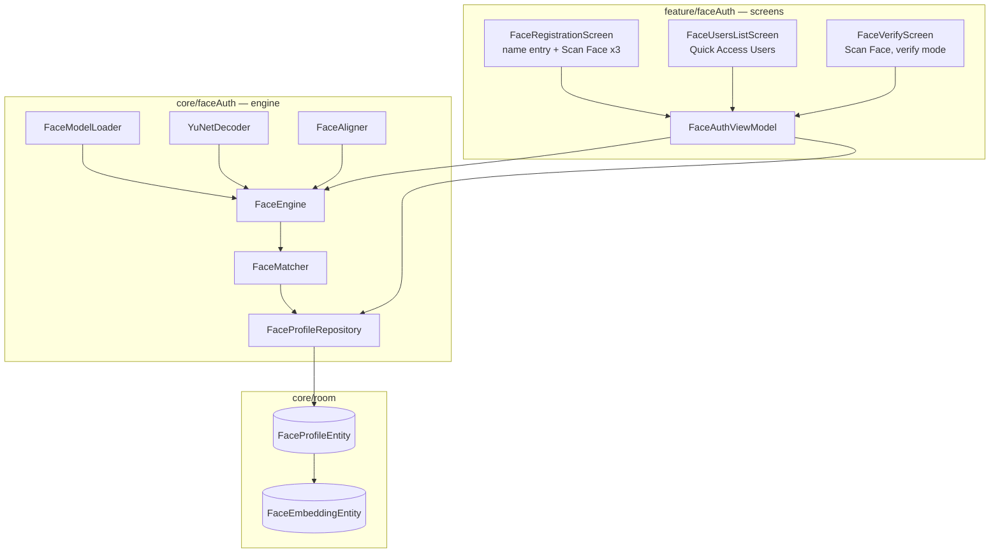
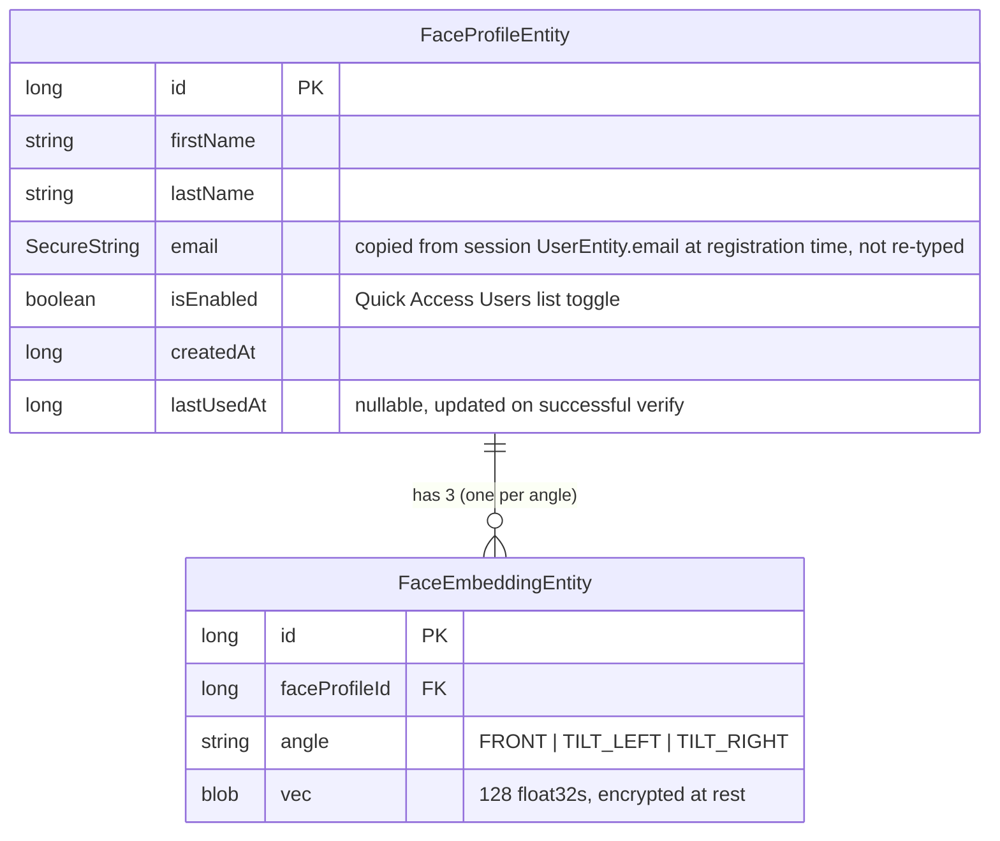

# Face Recognition "Quick Access" — Base Engine + Settings Screens

Status: approved for planning
Date: 2026-08-03
Reference: `standalone_face_tf.py` (repo root) — desktop proof-of-concept this design ports to Android.

## Summary

Add on-device face registration and verification ("Quick Access") as two new rows under Settings. This phase builds the working base: face detection, alignment, embedding, encrypted local storage, and matching — wired to real screens (using the already-designed Figma mockups) with a manual test path for verification. Idle/session-lock auto-trigger and blink-liveness are explicitly out of scope for this phase.

## Background

`standalone_face_tf.py` is a single-file desktop demo of the pipeline: YuNet (detector) finds a face + 5 landmarks, a similarity-transform aligns the crop to a canonical 112×112 pose, SFace (recognizer) turns the aligned crop into a 128-d embedding, and cosine similarity (threshold 0.38) matches a probe against a gallery of stored embeddings. Storage there is plain SQLite (`users` + `embeddings` tables). This spec ports that logic into the Android app, replacing OpenCV-desktop calls with the Android equivalents already used elsewhere in this codebase, and replaces the CLI with two new Settings-triggered screens (using the mockups already designed: "Face Access Onboarding" and "Quick Access Users" / "Add User").

## Decisions from brainstorming

- **Not tied to `feature/login`/`feature/verifyPin`.** This is a standalone local feature ("Quick Access"), not a replacement for PIN/OTP verification.
- **Identity fields:** first name + last name, typed at registration (per mockup "What's your name?" step). Email is **not** typed — it's auto-attached from the currently logged-in session's account (existing `UserEntity.email`), not a new form field.
- **Storage:** device-local only, via the app's existing Room database (`core/room`) — no backend sync, matching the reference script's per-device model.
- **Encryption:** model files use the existing encrypted-asset pattern (`ModelDecryptor`/`ModelKeyUnit`) already used for the pill/tray/glove detectors. Embedding storage should go through the same encryption utilities `SecurityUtils`/`core/security` already provides for sensitive Room fields (mirrors `SecureString`/`SecureStringConverter` used on `UserEntity.email`) rather than storing raw floats.
- **Multi-angle capture, not liveness (this phase):** the mockups' "Scan Face" steps capture front, tilt-left, and tilt-right — 3 embeddings per registration, directed instead of the script's passive 3-good-frames loop. This is enrollment robustness, not an anti-spoof check.
- **Liveness (blink detection) and the idle/"Session Locked" auto-trigger are explicitly deferred** to a later phase — not built now, not stubbed.
- **Multiple users per device:** the gallery holds many registered people (matches the script's 1:N `identify()` design and the mockup's "Quick Access Users" list with Bruce Wayne / Clark Kent / Peter Parker).
- **Verification test path for this phase:** no idle-lock wiring yet, so verification is proven via a manual trigger from the "Face Recognition Users" list screen (e.g. a per-row "Test" action, or tapping the row) that opens Scan Face in verify mode and shows the match/no-match result screens from the mockups.

## Architecture

Two layers, following the project's existing `core/` (engine) vs `feature/` (screens) split — the same split `core/scanning` + `feature/*` scanning screens already use.



### `core/faceAuth` — engine (new)

| Component | Ports from (script) | Notes |
|---|---|---|
| `FaceModelLoader` | — | Loads + decrypts `yunet_640x640_float16.tflite` + `sface_112x112_float16.tflite` from encrypted assets via existing `ModelDecryptor`/`ModelKeyUnit`. Singleton, mutex-guarded, GPU-delegate-aware — same shape as `PillDetectionModelLoader`. |
| `YuNetDecoder` | `yunet_preprocess()`, `yunet_decode()`, `_group_outputs()` | Anchor-grid decode (stride 8/16/32) → boxes + 5 landmarks + score. Feeds candidate boxes into the **existing** `core/scanning/logic/NMS.kt` (`NMS.run()`) instead of a new NMS implementation — same greedy-IoU algorithm as `cv2.dnn.NMSBoxes` used in the script. |
| `FaceAligner` | `similarity_transform()`, `align_crop()` | Umeyama similarity transform computed in Kotlin (no OpenCV needed for the math itself); crop warp via `Imgproc.warpAffine` (OpenCV-for-Android is already a project dependency — used today in `TrayColorDetector.kt`). |
| `FaceEngine` | `FaceEngine` class | `detect(bitmap): List<Face>`, `embed(bitmap, face): FloatArray` (128-d). Direct port of the script's class — same responsibilities, same threshold constants (`DET_SCORE_THRESHOLD=0.85`, `DET_NMS_THRESHOLD=0.3`, `MIN_FACE_WIDTH_PX=90`, `MAX_FACE_WIDTH_RATIO=0.85`, `MATCH_THRESHOLD=0.38`, `ENROLL_MIN_SHARPNESS=45.0`). |
| `FaceMatcher` | `identify()`, `normalize()`, `cosine()` | 1:N best-cosine search across every stored embedding for every user; returns best match + score, or none if below `MATCH_THRESHOLD`. |
| `FaceProfileRepository` | `Store` class | Wraps the Room DAOs (below); `registerUser()`, `listUsers()`, `deleteUser()`, `allEmbeddings()` — same operations as the script's `Store`, backed by Room instead of raw sqlite3. |

### `core/room` additions

New entities, added to the existing `AppDatabase` alongside `UserEntity` etc. (naming avoids collision with the existing account-level `UserEntity`):



Encryption of `vec`: reuse the project's existing `core/security` primitives (the same idea as `SecureStringConverter` for `UserEntity.email`) rather than storing raw bytes — a `@TypeConverters`-based converter that encrypts/decrypts the `FloatArray` through the existing keystore-backed utility.

### `feature/faceAuth` — screens (new)

Two new Settings rows (added to `SettingScreen.kt`, following its existing `Row { .clickable { navController.navigate(...) } }` pattern used for `Screen.RequireDoubleCount` etc.):

1. **"Face Recognition"** → `Screen.FaceRegistration.route` → `FaceRegistrationScreen`:
   - Reuses the mockup sequence: intro ("Setup Quick Access") → name entry (First Name, Last Name; email silently pulled from the logged-in session) → Scan Face ×3 (front / tilt-left / tilt-right, each producing one embedding via `FaceEngine`) → "Face Enrolled" success, with "Add User" (loops back to name entry for another person) and "Done" (returns to Settings).
2. **"Face Recognition Users"** → `Screen.FaceRecognitionUsers.route` → `FaceUsersListScreen`:
   - Mirrors the "Quick Access Users" mockup: list of registered profiles (name, last-used timestamp, enable/disable toggle), "+ Add User" (→ registration flow), delete.
   - Manual verify test: tapping a row (or a dedicated action) opens `FaceVerifyScreen` (Scan Face, verify mode) → live match against the gallery → mockup's "Welcome back, {name}" or "We couldn't recognize you" result screen.

`FaceAuthViewModel` (Hilt, per project convention) owns the registration/list/verify state and talks to `FaceEngine` + `FaceProfileRepository`.

### Navigation

`Screen.kt`: add `FaceRegistration` and `FaceRecognitionUsers` data objects (no arguments). `AppNavGraph.kt`: register both composables, following the existing pattern for other no-arg screens (e.g. `Screen.Settings`).

## Data flow

**Registration:**
```
Settings → "Face Recognition" tap
  → name entry (firstName, lastName typed; email read from session UserEntity)
  → Scan Face (front): CameraX frame → FaceEngine.detect() → largest face
      → quality gate (size/sharpness, same thresholds as script) → FaceEngine.embed()
  → Scan Face (tilt-left): same, prompts user to tilt
  → Scan Face (tilt-right): same
  → FaceProfileRepository.registerUser(firstName, lastName, email, [frontVec, leftVec, rightVec])
  → "Face Enrolled" screen
```

**Verify (manual test, this phase):**
```
Face Recognition Users list → tap row / test action
  → FaceVerifyScreen: CameraX frame → FaceEngine.detect() → FaceEngine.embed()
  → FaceMatcher.identify(probe, allEmbeddings) → best match ≥ 0.38?
      yes → "Welcome back, {name}" (also updates lastUsedAt)
      no  → "We couldn't recognize you" → Try Again / Cancel
```

## Error handling

Directly mirrors the script's existing guards — no new failure modes invented:
- No face detected in frame → mockup's "Place your face inside the square" state persists (no crash, no advance).
- Face too small/too close/blurry during registration capture → quality gate rejects the frame silently, same thresholds as `quality_gate()` in the script; user just keeps looking at the camera until a good frame lands.
- No match at verify time or score below `0.38` → "We couldn't recognize you" screen (mockup already covers this), with Try Again / Cancel.
- Model files missing/corrupt at load time → `FaceModelLoader` fails the same way `PillDetectionModelLoader` does today (surfaced as a load error, not a silent no-op).

## Testing

Since no automatic trigger (idle-lock) exists yet, "proving the base works" means:
- Unit tests for `YuNetDecoder` (anchor decode math) and `FaceAligner` (similarity transform) against known fixture inputs/outputs — deterministic, no camera needed.
- Unit tests for `FaceMatcher`/cosine matching against fixture embeddings (same-person ≥ 0.38, different-person < 0.38).
- Instrumented/manual test via the real screens: register a face through `FaceRegistrationScreen`, then use the manual verify test from `FaceUsersListScreen` to confirm a live camera match against the just-registered profile, and a non-match for an unregistered face.
- Room DAO tests for `FaceProfileEntity`/`FaceEmbeddingEntity`, following the existing `UserDaoTest` pattern in the repo.

## Explicitly out of scope (this phase)

- Idle-timeout / "Session Locked" auto-trigger screen and its timer logic.
- Blink-based (or any) liveness/anti-spoof check.
- Any backend sync of face profiles or embeddings.
- Tying a face profile to a specific backend account beyond auto-filling `email` at registration time (no ongoing link, no re-validation against the account).
