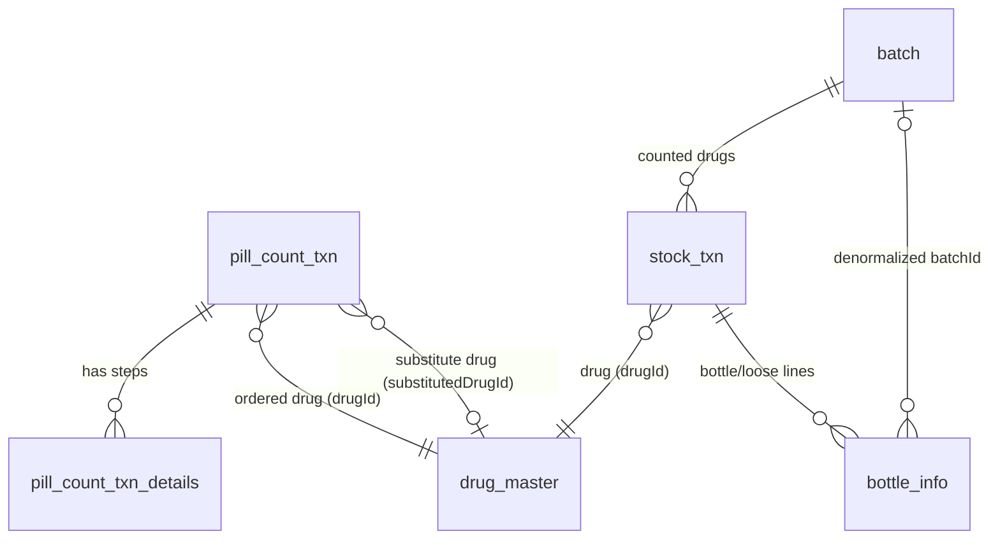

# History Detail Screens — Complete Reference

**App:** Mobrite Pill Counter (Android, Jetpack Compose)
**Branch:** `history-ui-changes`
**Scope:** Everything shown on the two "history detail" screens, how it changes per device/orientation, and exactly which database table + column feeds every value on screen.

> **Plain-language summary:** When you tap a row in the History list, you land on one of two screens depending on what kind of record you tapped: a **single dispense/count transaction** or a **stock-count batch**. Both screens read their data live from the on-device Room (SQLite) database — nothing is hardcoded. On a phone, everything is a single scrollable column of collapsible cards. On a tablet held sideways (landscape), the layout splits into two columns and every card is expanded by default. There is **no separate XML file per device** — this app is 100% Jetpack Compose, so "responsive layout" means Kotlin code branches at runtime based on the screen's width and rotation, not separate resource folders.

---

## Table of Contents

1. [The Two Screens at a Glance](#1-the-two-screens-at-a-glance)
2. [How "Device / Orientation" Is Detected](#2-how-device--orientation-is-detected)
3. [Screen A — Transaction History Detail](#3-screen-a--transaction-history-detail)
   - 3.1 [Per-device / per-orientation behavior](#31-per-device--per-orientation-behavior)
   - 3.2 [Field-by-field data source map](#32-field-by-field-data-source-map)
   - 3.3 [Section visibility rules](#33-section-visibility-rules)
4. [Screen B — Batch History Detail](#4-screen-b--batch-history-detail)
   - 4.1 [Per-device / per-orientation behavior](#41-per-device--per-orientation-behavior)
   - 4.2 [Field-by-field data source map](#42-field-by-field-data-source-map)
5. [Database Schema Reference](#5-database-schema-reference)
6. [File Index](#6-file-index)

---

## 1. The Two Screens at a Glance

| | Screen A — **Transaction Detail** | Screen B — **Batch Detail** |
|---|---|---|
| Shows | One dispense OR one regular pill-count session | One stock-count "batch" (a counting session covering many drugs) |
| Opened from | Tapping a row in the main History list | Tapping a row in the Batch History list |
| Main Kotlin file | `HistoryDetailScreen.kt` | `BatchHistoryDetailScreen.kt` |
| Main data table | `pill_count_txn` (+ its detail rows + drug info) | `batch` (+ its `stock_txn` / `bottle_info` rows + drug info) |
| ViewModel | `HistoryDetailsViewModel` | `BatchViewModel` |

These are **two independent screens with two independent layouts** — they don't share a composable, only some small helpers (`HeadlineBar`, `CommonDialog`, date formatters).

---

## 2. How "Device / Orientation" Is Detected

There is no `res/layout-land/` or `res/layout-sw600dp/` anywhere in this project (confirmed: the app has a single `res/layout/` and it is otherwise unused — Compose does not use XML layouts at all). Instead, every screen reads Android's live configuration at draw time:

```kotlin
// app/src/main/java/com/rite/pillcounting/core/utils/common/UserInterfaceUtils.kt:163-176
object UserInterfaceUtils {
    const val TABLET_BREAKPOINT_DP = 600

    @Composable
    fun isTablet(): Boolean =
        LocalConfiguration.current.smallestScreenWidthDp >= TABLET_BREAKPOINT_DP

    @Composable
    fun isLandscape(): Boolean =
        LocalConfiguration.current.orientation == Configuration.ORIENTATION_LANDSCAPE
}
```

**Plain language:** "Tablet" means the phone/tablet's *shortest side* is 600dp or more (this is the same breakpoint Android itself recommends for tablets — roughly a 7" screen or larger). "Landscape" means the device is currently rotated sideways. These two booleans are recalculated automatically every time Compose redraws, so rotating a tablet live flips the layout without restarting the screen.

This gives **4 possible device states**, and both screens (in slightly different ways) branch on them:

| State | `isTablet()` | `isLandscape()` |
|---|---|---|
| Phone – Portrait | false | false |
| Phone – Landscape | false | true |
| Tablet – Portrait | true | false |
| Tablet – Landscape | true | true |

---

## 3. Screen A — Transaction History Detail

**Entry point:** `HistoryDetailScreen.kt:32` → route `"history_detail"` (no navigation argument — the target transaction's ID is stashed beforehand in `PreferenceHelper.getTxnId()` by whoever navigates here).

**How the screen gets its data (end to end):**

```
HistoryDetailScreen (Compose UI)
        │  reads
        ▼
HistoryDetailsUiState.txnInfo   (a TxnWithDetails object)
        │  produced by
        ▼
HistoryDetailsViewModel.getTransactionDetails()
        │  calls
        ▼
PillCountTxnDao.getTxnWithDetails(txnId)   ← one SQL query, joins 3 tables
        │  reads
        ▼
pill_count_txn  ⋈  drug_master (x2)  ⋈  pill_count_txn_details
```

The single SQL query behind everything (`PillCountTxnDao.kt:385-427`):

```sql
SELECT
    pct.txnId,
    CASE WHEN pct.isSubstitute = 1 AND subDrug.drugName IS NOT NULL
         THEN subDrug.drugName ELSE dm.drugName END AS drugName,
    ... (ndc, drugType, strength, dosageForm — same substitute-aware pattern) ...
    pct.targetCount, pct.note, pct.createdAt, pct.bottleInfoListJson,
    pct.isComingFromHL7, pct.isDispense, pct.isSubstitute, pct.workflowStep,
    dm.drugName AS requestedDrugName,   -- always the ORIGINALLY ordered drug
    dm.ndc      AS requestedNdc,
    IFNULL(SUM(pcd.pillCount), 0) AS totalPillCount
FROM pill_count_txn AS pct
LEFT JOIN drug_master AS dm      ON pct.drugId = dm.drugId
LEFT JOIN drug_master AS subDrug ON pct.substitutedDrugId = subDrug.drugId
LEFT JOIN pill_count_txn_details AS pcd ON pct.txnId = pcd.txnId AND pcd.isDeleted = 0
WHERE pct.txnId = :transactionId AND pct.isDeleted = 0
GROUP BY pct.txnId
```

**Plain language:** the query pulls one transaction, joins it to the drug catalog **twice** — once for the drug that was originally ordered, once for whatever drug it was substituted with (if any) — and joins it to every individual pill-count detail row (the small entries created every time a scan/count step happens). The `isSubstitute` flag decides, column by column, whether the substitute drug's info or the original drug's info wins the display.

The individual count/photo rows (`pill_count_txn_details`) come back automatically attached via a Room `@Relation` (`TxnWithDetails.kt:23-29`); the ViewModel then filters out soft-deleted ones client-side, since Room's auto-relation query can't filter on `isDeleted` itself (`HistoryDetailsViewModel.kt:34-39`).

### 3.1 Per-device / per-orientation behavior

All of the following logic lives in one file: `feature/history/presentation/compose/DrugInfoSection.kt`.

```kotlin
// DrugInfoSection.kt:112-135
val isTabletLandscape = configuration.smallestScreenWidthDp >= 600 &&
    configuration.orientation == Configuration.ORIENTATION_LANDSCAPE
if (isTabletLandscape) {
    TabletLandscapeDrugInfo(...)   // completely different composable, returns early
    return
}
```

| Device state | Layout used | What's different |
|---|---|---|
| **Phone – Portrait** | Single-column, scrollable | Each section is its own collapsible card (`SectionBox`, `allowCollapse = true`). Drug details render as a flat key/value list. Per-step batch photos scroll horizontally in a row. |
| **Phone – Landscape** | Same single-column layout as phone-portrait | `isTablet()` is false, so the tablet-landscape branch never triggers — a phone stays in the normal single-column view even rotated. Only the horizontal scroll area gets shorter. |
| **Tablet – Portrait** | Single-column layout, but tablet rules apply | Sections are **not individually collapsible** (`allowCollapse = !tablet` → always expanded, chevron hidden). Drug details render as a **swipeable pager** — one page per physical bottle scanned — instead of a flat list. Per-step batch photos still scroll in a horizontal row (since `useGrid = tablet && landscape` is false here). |
| **Tablet – Landscape** | **Completely different two-column layout** (`TabletLandscapeDrugInfo`) | Left column: Requested Drug Details card → swipeable Dispensed-Drug-Details pager → Notes card. Right column: side-by-side QR/Vial image cards, then one "landscape count section" per recorded step, each showing its count inline in the card header (e.g. `"12/20"`) instead of a separate number block. Per-step batch photos switch from a horizontal row to a **grid** (`useGrid = true`). |

**Extra tablet-only behaviors** (apply in both tablet portrait and tablet landscape):
- `DispenseDrugDetailsSection` (`DrugInfoSection.kt:732-780`) swaps a static list of drug details for a `BottleDetailsPager` — a horizontally swipeable card per bottle, each page showing that bottle's own lot/expiry/serial alongside the shared drug name/NDC/date/time.
- Section headers lose their collapse/expand chevron, since tablets have enough vertical space to show everything expanded.

### 3.2 Field-by-field data source map

| What you see on screen | Where in the UI code | Database source |
|---|---|---|
| Screen title (drug name in top bar) | `HistoryDetailScreen.kt:49` | `drug_master.drugName` (substitute-aware — see query above) |
| NDC | `HistoryDetailScreen.kt:68` | `drug_master.ndc` (substitute-aware) |
| Drug type (decides which section layout is used — see §3.3) | `HistoryDetailScreen.kt:81` | `drug_master.drugType` (substitute-aware) |
| Expiry / Lot No / Serial No (top-level, non-bottle-specific fields) | `HistoryDetailScreen.kt:71-74` | **Always blank on this screen.** These were moved to the normalized stock tables (`bottle_info`) and were never written for dispense transactions. Kept as empty strings intentionally — not a bug. |
| Date / Time | `HistoryDetailScreen.kt:75-76` | `pill_count_txn.createdAt` (epoch millis, formatted client-side) |
| Note | `HistoryDetailScreen.kt:77` | `pill_count_txn.note` |
| Container QR / barcode image | `HistoryDetailScreen.kt:78` | `pill_count_txn.bottleInfoListJson` → JSON-decoded list, first bottle's `barcodeImagePath` |
| Target count (used for the "x / target" fraction) | `HistoryDetailScreen.kt:79` | `pill_count_txn.targetCount` |
| Every count-section's photos + per-photo pill counts | `HistoryDetailScreen.kt:80` | `pill_count_txn_details` rows (`pillCount`, `imagePath`, `type`) linked to the transaction |
| "From HL7" flag (drives some downstream behavior, not directly rendered as text) | `HistoryDetailScreen.kt:82` | `pill_count_txn.isComingFromHL7` |
| Substituted flag (shows/hides the "Requested Drug Details" card) | `HistoryDetailScreen.kt:83` | `pill_count_txn.isSubstitute` |
| "Requested Drug Details" name/NDC (only shown when substituted) | `HistoryDetailScreen.kt:84-85` | `drug_master.drugName` / `drug_master.ndc` for the **originally ordered** drug (query aliases these `requestedDrugName` / `requestedNdc`, always from `dm`, never `subDrug`) |
| Per-bottle cards in the tablet pager (lot/expiry/serial per bottle) | decoded from `bottleList` | `pill_count_txn.bottleInfoListJson` (JSON array, one entry per physical bottle scanned during that transaction) |
| Section count totals (e.g. "Total Count: 45") | computed client-side | `SUM(pill_count_txn_details.pillCount)` for the matching step type |

### 3.3 Section visibility rules

The screen doesn't show a fixed list of sections — each one only appears if the transaction actually recorded that step. This is driven by the `type` column on `pill_count_txn_details`, which stores one of these values (`StepState.kt:5-14`):

`STOCK_COUNT`, `RX_LABEL`, `SCAN`, `CONTAINER_INITIATE`, `TARGET_VERIFICATION`, `TARGET_REVERIFICATION`, `VIAL`, `CONTAINER_PENDING`

Two different section orders exist, chosen by whether `drugType` came back null or not (`DrugInfoSection.kt:162` / `:475`):

| `drug_master.drugType` is **null** (dispense flow) | `drug_master.drugType` is **not null** (stock/regular count flow) |
|---|---|
| 1. Pill Count *(only if `TARGET_VERIFICATION` rows exist)* | 1. Initial Stock Bottle Count *(only if `CONTAINER_INITIATE` rows exist)* |
| 2. Dispense / Substitute Drug Details | 2. Dispense Drug Details |
| 3. Vial Capture *(only if `VIAL` rows exist)* | 3. Pill Count *(only if `TARGET_VERIFICATION` rows exist)* |
| 4. Notes | 4. Pill Recount *(only if `TARGET_REVERIFICATION` rows exist)* |
| | 5. Vial Capture *(only if `VIAL` rows exist)* |
| | 6. Remaining Stock Bottle Count *(only if `CONTAINER_PENDING` rows exist)* |
| | 7. Notes |

Other conditional rules:
- **Substitution:** if `pill_count_txn.isSubstitute = 1`, an extra "Requested Drug Details" card appears above the main drug-details card, and that main card's title changes from "Dispense Drug Details" to "Substitute Drug Details".
- **Delete:** the trash icon in the top bar opens a confirm dialog; confirming calls `PillCountTxnDao.softDelete(txnId)` — this sets `pill_count_txn.isDeleted = 1`, it does **not** remove the row from the database.
- **Image preview:** tapping any thumbnail (batch photo, vial photo, QR code) opens a full-screen image dialog over the whole screen.

---

## 4. Screen B — Batch History Detail

**Entry point:** `BatchHistoryDetailScreen.kt:59` → route `"batch_history_detail/{batch_id}"`. If `batch_id` is `0`, the screen resolves the most recent batch automatically (`BatchViewModel.kt:56-57`).

**How the screen gets its data (end to end):**

```
BatchHistoryDetailScreen (Compose UI)
        │  reads
        ▼
BatchViewModel.batchEntity / uniqueNdcCount / drugGroups
        │
        ├─ batchEntity        ← BatchDao.getById(batchId)                     (table: batch)
        ├─ uniqueNdcCount     ← StockTxnDao.getUniqueNdcCountForBatch(id)     (table: stock_txn)
        └─ drugGroups         ← BottleInfoDao.observeByBatchId(id)           (tables: bottle_info ⋈ stock_txn ⋈ drug_master)
                                    │
                                    ▼
                          BatchViewModel.groupAndMap()  — groups rows by drug, splits into
                                                          "sealed bottle" lots vs "opened/loose" lots
```

The bottle-level SQL query (`BottleInfoDao.kt:99-121`):

```sql
SELECT
    b.bottleId AS txnId, s.drugId AS drugId,
    dm.drugName AS drugName, dm.ndc AS ndc,
    b.lotNo AS lotNo, b.expNo AS expiry,
    b.bottleQty AS bottleQty, b.looseQty AS looseQty,
    dm.packageQty AS packageQty
FROM bottle_info AS b
INNER JOIN stock_txn AS s ON b.stockTxnId = s.txnId
LEFT JOIN drug_master AS dm ON s.drugId = dm.drugId
WHERE b.batchId = :batchId AND s.isDeleted = 0
ORDER BY dm.drugName ASC
```

**Plain language:** every row here is one physical bottle (or loose-pill line) that was scanned during the batch, for one drug. `groupAndMap()` then collapses all the bottle rows for the same drug into one card: sealed bottles are multiplied out (`bottleQty × packageQty` = pills inside sealed bottles), loose/opened pills are counted as-is (`looseQty`), and the two are summed into the drug's total.

### 4.1 Per-device / per-orientation behavior

Unlike Screen A, **this screen has no tablet/landscape layout branch** — the same single-column `LazyColumn` list is used on every device and orientation. `BatchHistoryDetailScreen.kt` and `BatchNdcCard.kt` only apply `responsiveDp(...)` / `responsiveSpForBatchScreen(...)` — these scale padding, font size, and icon size by screen density/size, but they never change which elements are shown or how they're arranged.

| Device state | Layout | Notes |
|---|---|---|
| Phone – Portrait | Single scrollable list of drug cards | Baseline sizing |
| Phone – Landscape | Same single scrollable list | Only visible change is more items fit side-to-side per line wrap; no structural change |
| Tablet – Portrait | Same single scrollable list | Slightly larger text/spacing via `responsiveDp`/`responsiveSpForBatchScreen` |
| Tablet – Landscape | Same single scrollable list | Same as tablet-portrait — this screen does not implement the two-column tablet-landscape mode that Screen A has |

Each drug's card (`BatchNdcCard`) starts collapsed, showing only the drug name, NDC, and total pill count. Tapping it expands/collapses two sub-sections ("Sealed Bottles" and "Opened Bottles"), each with its own Lot No / Expiry Date / Pills table and running total — this expand/collapse behavior is identical on every device.

### 4.2 Field-by-field data source map

| What you see on screen | Where in the UI code | Database source |
|---|---|---|
| Title: `"Batch #<id>"` | `BatchHistoryDetailScreen.kt:74` | `batch.batchId` |
| Total NDC count | `BatchHistoryDetailScreen.kt:131-141` | `COUNT(DISTINCT stock_txn.drugId)` for the batch (`StockTxnDao.getUniqueNdcCountForBatch`) |
| "Completed on `<date>` `<time>`" (only shown if status is COMPLETED) | `BatchHistoryDetailScreen.kt:143-163` | `batch.status`, `batch.endDateTime` |
| "Partial" badge (shown when not completed) | `BatchHistoryDetailScreen.kt:164-171` | `batch.status` |
| Notes card (only rendered if note is non-blank) | `BatchHistoryDetailScreen.kt:177-182` | `batch.note` |
| PDF export button — batch metadata baked into the PDF | `BatchHistoryDetailScreen.kt:99-109` | `batch.status`, `batch.startDateTime`, current user, plus the same `drugGroups` data below |
| Drug card: drug name | `BatchNdcCard.kt:58` | `drug_master.drugName` |
| Drug card: NDC | `BatchNdcCard.kt:65` | `drug_master.ndc` |
| Drug card: total pill count (header, always visible) | `BatchNdcCard.kt:77` | Computed: `sealedTotal + openedTotal` in `BatchViewModel.groupAndMap()` |
| "Sealed Bottles" header quantity (bottle count, expanded view) | `BatchNdcCard.kt:98` | `SUM(bottle_info.bottleQty)` for that drug |
| Sealed lot table rows: Lot No / Expiry / Pills | `BatchNdcCard.kt:181-213` | `bottle_info.lotNo`, `bottle_info.expNo`, and `bottleQty × drug_master.packageQty` |
| Opened lot table rows: Lot No / Expiry / Pills | same composable, `openedLots` list | `bottle_info.lotNo`, `bottle_info.expNo`, `bottle_info.looseQty` |
| "Total Pills" footer per section | `BatchNdcCard.kt:222-234` | Sum of that section's lot counts |

Deleting the batch (trash icon) calls `BatchDao.softDelete(batchId)` (`batch.isDeleted = 1`) and also removes its `stock_txn` rows via `StockTxnDao.deleteByBatchIds`.

---

## 5. Database Schema Reference

All tables live in the on-device Room/SQLite database. Foreign keys use `SET_NULL` (parent deleted → child's reference goes null, row is kept) except where noted.

### `pill_count_txn` — one row per dispense or regular pill-count transaction
*(Entity: `PillCountTxnEntity.kt`)*

| Column | Type | Meaning |
|---|---|---|
| `txnId` | Long, PK, auto | Unique transaction ID |
| `localId` | Long?, FK → `UserEntity.localId` | Which local user ran this transaction |
| `drugId` | Long?, FK → `drug_master.drugId` | Drug that was ordered/counted |
| `isDispense` | Boolean | True = dispense workflow, false = regular count |
| `targetCount` | Int? | Expected pill count for reconciliation |
| `status` | CountStatus enum | Transaction status |
| `note` | String? | Free-form note shown on the detail screen |
| `isSubstitute` | Boolean | Whether a substitute drug was dispensed instead of the ordered one |
| `rxNo`, `refillNo`, `patientName` | String? | Prescription metadata (not currently rendered by either detail screen) |
| `isDeleted` | Boolean | Soft-delete flag |
| `createdAt`, `updatedAt` | Long | Epoch-millis timestamps |
| `isComingFromHL7` | Boolean? | Whether the order arrived via an HL7 message |
| `isSynced`, `isNdcVerified` | Boolean? | Sync/verification flags |
| `bucketId` | String? | Container/bucket association |
| `substitutedDrugId` | Long?, FK → `drug_master.drugId` | The substitute drug, if any |
| `workflowStep` | String? | Where in the multi-step flow this transaction currently is |
| `priority` | TxnPriority? | Queue priority |
| `isGlovesPresent`, `hazardousTrayDetected` | Boolean/Boolean? | Safety-check flags |
| `hl7MessageControlId`, `hl7SequenceNumber`, `transactionOrderId` | String? | HL7 correlation identifiers |
| `bottleInfoListJson` | String? | JSON-encoded list of scanned bottles (lot/expiry/serial/barcode image per bottle) |

### `pill_count_txn_details` — one row per photo/count step inside a transaction
*(Entity: `PillCountTxnDetailsEntity.kt`, cascades on parent delete)*

| Column | Type | Meaning |
|---|---|---|
| `txnDetailsId` | Long, PK, auto | Unique detail row ID |
| `txnId` | Long?, FK → `pill_count_txn.txnId` (CASCADE) | Parent transaction |
| `pillCount` | Int? | Pills counted in this step/photo |
| `imagePath` | String? | Path to the captured image |
| `type` | String? | One of the `StepState` values — decides which section this row belongs to |
| `isManual` | Boolean | Manually entered vs. auto-detected |
| `isDeleted` | Boolean | Soft-delete flag |
| `createdAt`, `updatedAt` | Long | Timestamps |

### `drug_master` — the local drug catalog
*(Entity: `DrugMasterEntity.kt`)*

| Column | Type | Meaning |
|---|---|---|
| `drugId` | Long, PK, auto | Unique drug ID |
| `drugName` | String? | Display name |
| `ndc` | String, unique | National Drug Code |
| `drugType` | String? | Classification — also drives which section-order the detail screen uses |
| `createdAt` | Long | Timestamp |
| `gtin` | String? | Global Trade Item Number |
| `packageQty` | Int? | Pills per sealed package — used to compute sealed-bottle pill totals |
| `isHazardous` | Boolean | Hazard flag |
| `strength`, `dosageForm` | String? | Clinical metadata |
| `drugImagePath` | String? | Local path to the downloaded drug thumbnail |

### `batch` — one row per stock-count session
*(Entity: `BatchEntity.kt`)*

| Column | Type | Meaning |
|---|---|---|
| `batchId` | Long, PK (not auto-generated) | Batch identifier |
| `startDateTime` | Long | When the batch began |
| `endDateTime` | Long? | When it was completed (null while in progress) |
| `status` | BatchStatus enum (`INPROGRESS` / `COMPLETED`) | Drives the "Completed on…" vs "Partial" UI |
| `isDeleted` | Boolean | Soft-delete flag |
| `note` | String? | Batch-level note |
| `bucketId` | String? | Container association |
| `requestIdFromPMS` | String? | Pharmacy-management-system request correlation ID |
| `isSynced` | Boolean | Sync flag |
| `lastAckedChunkIndex`, `totalChunks` | Int/Int? | HL7 chunked-sync resume markers |
| `totalNdcs` | Int? | Distinct drug count for this batch |
| `userName` | String? | Who ran the batch |

### `stock_txn` — one row per drug counted inside a batch
*(Entity: `StockTxnEntity.kt`)*

| Column | Type | Meaning |
|---|---|---|
| `txnId` | Long, PK, auto | Unique row ID |
| `drugId` | Long?, FK → `drug_master.drugId` | The drug being counted |
| `status` | CountStatus enum | Row status |
| `isDeleted` | Boolean | Soft-delete flag |
| `createdAt`, `updatedAt` | Long | Timestamps |
| `bucketId` | String? | Container association |
| `batchId` | Long?, FK → `batch.batchId` | Parent batch |

### `bottle_info` — one row per physical bottle/loose-pill line counted
*(Entity: `BottleInfoEntity.kt`, cascades on `stock_txn` delete)*

| Column | Type | Meaning |
|---|---|---|
| `bottleId` | Long, PK, auto | Unique row ID |
| `stockTxnId` | Long, FK → `stock_txn.txnId` (CASCADE) | Parent drug-count row |
| `batchId` | Long?, FK → `batch.batchId` | Denormalized copy of the parent's batch, for cheap batch-scoped queries |
| `lotNo` | String? | Lot/batch number scanned off the label |
| `expNo` | String? | Expiry date (formatted string, e.g. `MM-dd-yyyy`) |
| `serialNo` | String? | GS1 serial number, if present |
| `bottleQty` | Int? | Number of sealed bottles for this lot |
| `looseQty` | Int? | Number of loose/open pills counted for this lot |
| `createdAt`, `updatedAt` | Long | Timestamps |

### Relationship diagram



---

## 6. File Index

| File | Role |
|---|---|
| `app/src/main/java/com/rite/pillcounting/feature/history/presentation/HistoryDetailScreen.kt` | Screen A composable — transaction detail |
| `app/src/main/java/com/rite/pillcounting/feature/history/presentation/viewmodel/HistoryDetailsViewModel.kt` | Screen A ViewModel |
| `app/src/main/java/com/rite/pillcounting/feature/history/presentation/compose/DrugInfoSection.kt` | All of Screen A's section rendering + every device/orientation branch |
| `app/src/main/java/com/rite/pillcounting/core/room/dao/PillCountTxnDao.kt` | `getTxnWithDetails` query (Screen A's data source) |
| `app/src/main/java/com/rite/pillcounting/core/room/models/dtos/TxnWithDetails.kt` | Screen A's query-result DTO shape |
| `app/src/main/java/com/rite/pillcounting/feature/history/presentation/BatchHistoryDetailScreen.kt` | Screen B composable — batch detail |
| `app/src/main/java/com/rite/pillcounting/feature/batchCount/presentation/viewmodel/BatchViewModel.kt` | Screen B ViewModel, incl. `groupAndMap()` |
| `app/src/main/java/com/rite/pillcounting/feature/batchCount/presentation/compose/BatchNdcCard.kt` | Screen B's per-drug card |
| `app/src/main/java/com/rite/pillcounting/core/room/dao/BottleInfoDao.kt` | `observeByBatchId` query (Screen B's data source) |
| `app/src/main/java/com/rite/pillcounting/core/utils/common/UserInterfaceUtils.kt` | `isTablet()` / `isLandscape()` — the device/orientation detection used everywhere |
| `app/src/main/java/com/rite/pillcounting/core/room/models/PillCountTxnEntity.kt` | `pill_count_txn` table definition |
| `app/src/main/java/com/rite/pillcounting/core/room/models/PillCountTxnDetailsEntity.kt` | `pill_count_txn_details` table definition |
| `app/src/main/java/com/rite/pillcounting/core/room/models/DrugMasterEntity.kt` | `drug_master` table definition |
| `app/src/main/java/com/rite/pillcounting/core/room/models/BatchEntity.kt` | `batch` table definition |
| `app/src/main/java/com/rite/pillcounting/core/room/models/StockTxnEntity.kt` | `stock_txn` table definition |
| `app/src/main/java/com/rite/pillcounting/core/room/models/BottleInfoEntity.kt` | `bottle_info` table definition |
| `app/src/main/java/com/rite/pillcounting/core/models/StepState.kt` | The step-type enum that controls section visibility on Screen A |
